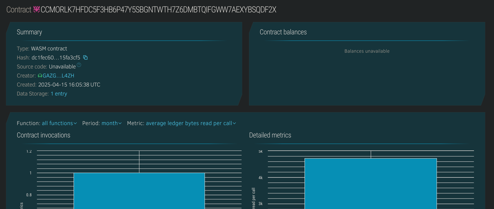

# Blockchain-Based Student ID

## Project Description
The Blockchain-Based Student ID project implements a decentralized digital identification system for educational institutions using the Soroban SDK on the Stellar blockchain. This solution replaces traditional physical student ID cards with secure, tamper-proof digital identities that can be easily verified and managed by both students and educational institutions.

## Project Vision
Our vision is to revolutionize student identification systems by leveraging blockchain technology to create a secure, portable, and verifiable digital identity that empowers students and educational institutions. This system aims to eliminate fraud, streamline administrative processes, and provide students with ownership of their educational credentials and identity.

## Key Features
- **Secure Digital Student ID**: Issue and verify student identities on the blockchain, ensuring tamper-proof credentials
- **Credential Management**: Store and manage student information including enrollment status, program details, and access privileges
- **Verification System**: Allow third parties to verify student status without compromising personal data
- **Self-Sovereign Identity**: Give students control over their own educational identity and credentials
- **Administrative Controls**: Provide educational institutions with management tools for issuing, updating, and revoking student IDs

## Future Scope
- **Integration with Campus Services**: Connect the student ID system with library access, cafeteria payments, and other campus services
- **Cross-Institution Verification**: Enable credential verification across different educational institutions
- **Digital Transcripts and Certificates**: Expand the system to include academic achievements, course completions, and degree certifications
- **Alumni Network Integration**: Maintain graduate credentials and facilitate alumni networking and verification
- **Integration with Job Platforms**: Allow graduates to share verified credentials directly with potential employers
- **Mobile Application**: Develop a dedicated mobile app for easy access to digital student IDs
- **Biometric Authentication**: Enhance security with additional verification methods

##  Contract Details:
CCMORLK7HFDC5F3HB6P47Y5SBGNTWTH7Z6DMBTQIFGWW7AEXYBSQDF2X
